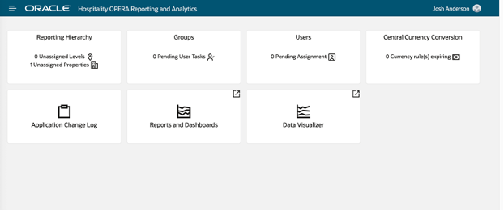
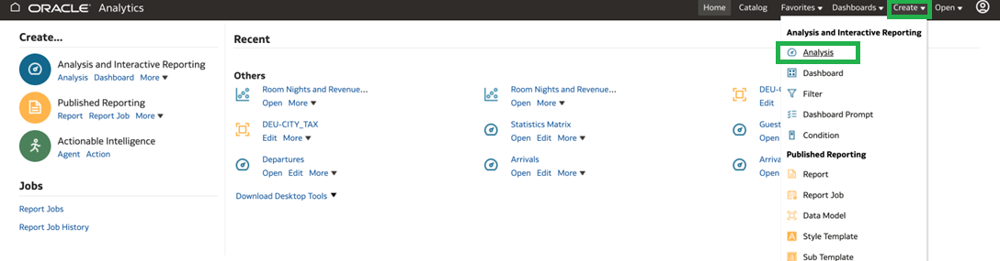
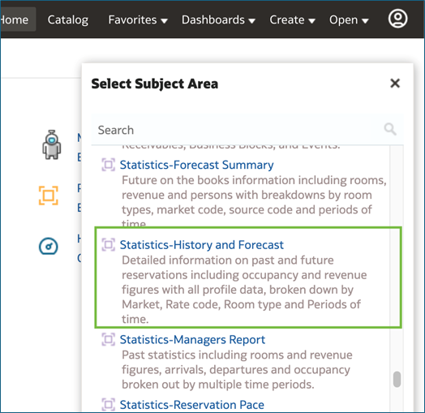
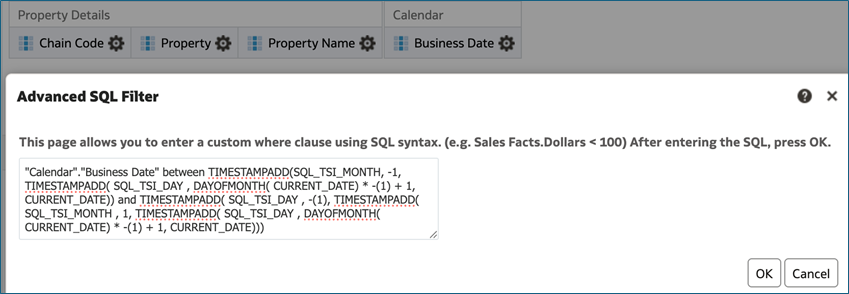
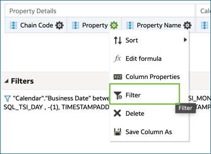
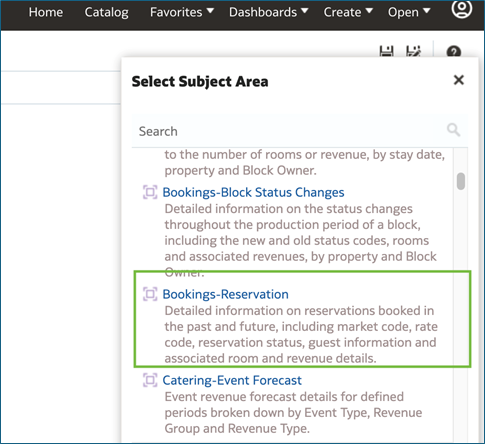
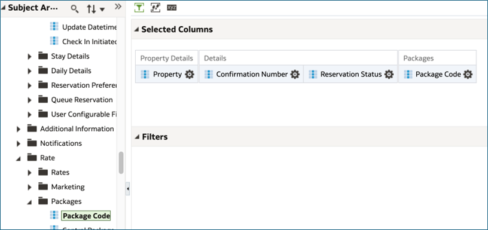

# Working with Advanced Functions and Filters

Getting started with Oracle Hospitality Reporting and Analytics

1. [Accessing the Reporting Application](#1-accessing-the-reporting-application)
2. [Accessing Analysis](#2-accessing-analysis)
3. [Utilizing SQL to Filter Dates Dynamically and 1st alphabetically listed resort in a prompt](#3-utilizing-sql-to-filter-dates-dynamically-and-1st-alphabetically-listed-resort-in-a-prompt)
4. [Utilizing LISTAGG Function to combine Package Codes into a Single Column Output](#4-utilizing-listagg-function-to-combine-package-codes-into-a-single-column-output)

## 1. Accessing the Reporting Application

1. Access the R&A Portal application from your instance or the provided instance.

2. b.	From the Portal home page, select on the Reports and Dashboards Tile, alternatively from the drop down menu you can select Reports and Dashboards.



## 2. Accessing Analysis

1.	From the Reporting application, on the left hand Create menu, select analysis, or select create on the right hand menu, and choose analysis.



2.	Choose the Statistics – History and Forecast subject area



## 3. Utilizing SQL to Filter Dates Dynamically and 1st alphabetically listed resort in a prompt

2.	Add the following fields to the criteria screen as seen below:

|Fields for Analysis Report|
| ---------------------------------- |
|Property Details – Chain Code|
|Property Details – Property|
|Property Details – Property Name|
|Date – Calendar – Business Date|


 
3.	Select the Gear icon on Business Date, and select Filter


 
4.	Change the operator to be Between and select the convert this filter to SQL, then select OK


 
5.	Replace the entire SQL formula with the below formula, to filter the data from the first day of the previous month through the last day of the current month and select OK

```"Calendar"."Business Date" between TIMESTAMPADD(SQL_TSI_MONTH, -1, TIMESTAMPADD( SQL_TSI_DAY , DAYOFMONTH( CURRENT_DATE) * -(1) + 1, CURRENT_DATE)) and TIMESTAMPADD( SQL_TSI_DAY , -(1), TIMESTAMPADD( SQL_TSI_MONTH , 1, TIMESTAMPADD( SQL_TSI_DAY , DAYOFMONTH( CURRENT_DATE) * -(1) + 1, CURRENT_DATE))) ```
 

 
6.	Select the Gear icon on the Property Field, and select Filter


 
7.	Change the Operator value to be is prompted and select OK

8.	Select the Prompts tab


9.	Select the + icon and choose column prompt, and select Property
 
 

10. Select the Options dropdown, and under the default selection, choose SQL Results
 

	
11. Copy the below into the formula field, to list the 1st alphabetically listed resort and select OK

```Select MIN("Property Details"."Property") FROM "Bookings-Reservation" ```


 
12. Select the Save as Option and choose the Shared Folder/{OrgCode}/Bootcamp/YOURNAME directory and save the analysis as Advanced Filters Dates and Resort

13. Navigate to the catalog and Open the Advanced Filters Dates and Resort analysis and select Open
 
 
 
14.	Select OK to run the analysis, the output should look like the below


# 4. Utilizing LISTAGG Function to combine Package Codes into a Single Column Output

1.	From the top right menu, select create -> Analysis and choose the Bookings - Reservation subject area 
 
 
 
2.	Add the following fields to the criteria screen as seen below	

|Fields for Analysis Report|
| ---------------------------------- |
|Property Details – Property|
|Reservation Overview – Details – Confirmation Number|
|Reservation Overview – Details – Reservation Status|
|Rate – Packages – Package Code|


 
3.	Using skills learned from the previous exercise, select the Gear icon on the Property Field, and select Filter

 
 
4.	Change the Operator value to be is prompted and select OK

5.	Select the Gear icon on Reservation status and select Filter

 
 
6.	Leave the operator as equal to /is in and add a hard coded filter for RESERVED and select OK

 
 
7.	Select the gear icon on Package Code and select Filter


 
8.	Change the operator to is not null and select OK


 
9.	Select the Gear icon on Package Code and select Edit Formula


 
10. In front of the "Packages"."Package Code" add LISTAGG( and close the parenthesis at the end

* The formula should now be the below ```LISTAGG("Packages"."Package Code")```

11. Select the Custom Headings check box to maintain the name of the column and select OK

 

12. Select the Prompts tab
 
 

13. Select the + icon and choose column prompt, and select Property

  

14. Select the Options dropdown, and under the default selection, choose SQL Results

 

15. Copy the below into the formula field, to list the 1st alphabetically listed resort and select OK

```Select MIN("Property Details"."Property") FROM "Bookings-Reservation"```
 
 

16. Select the Save as Option and choose the Shared Folder/{OrgCode}/Bootcamp/YOURNAME directory and save the analysis LISTAGG Function

17. Navigate to the catalog and Open the LISTAGG Function analysis and Select Open
 
 
 
18. Select OK to run the analysis, the output should look like the below


