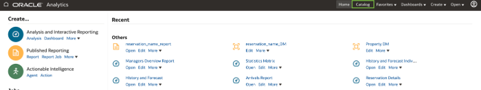
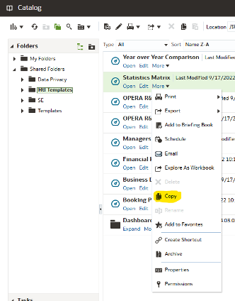
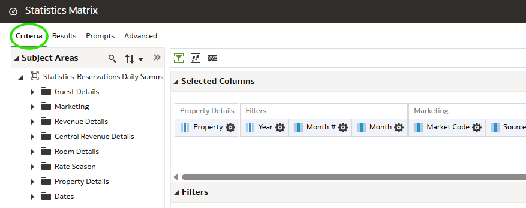
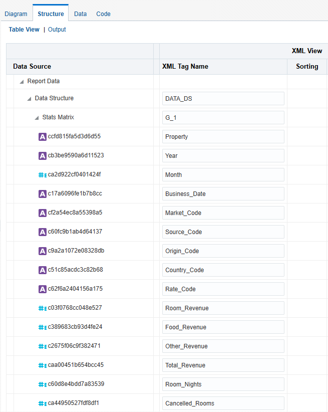
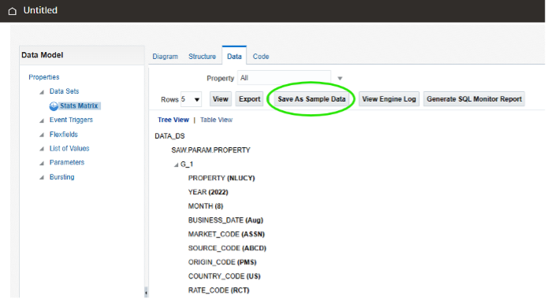
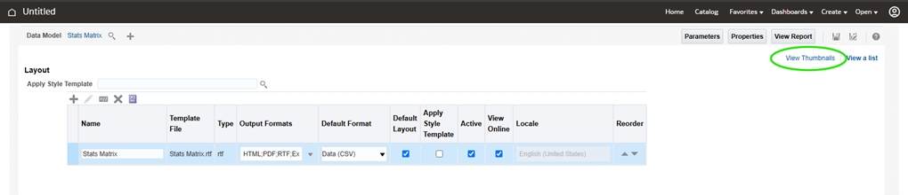

# Convert Analysis Report to a BI Publisher Report

Getting started with Oracle Hospitality Reporting and Analytics

1. [Accessing Reports](#1-accessing-catalog)
2. [Converting an Analysis Report to a BIP Publisher Report](#2-converting-an-analysis-report-to-a-bi-publisher-report)

## 1. Accessing Catalog

1. Access the R&A Portal application from your instance or the provided instance.
2. From the Portal home page, select on the Reports and Dashboards Tile, alternatively from the drop down menu you can select Reports and Dashboards.

3. From the main Oracle Analytics page, select the Catalog option

## 2. Converting an Analysis Report to a BI Publisher Report

1. Open the Shared Folders > Htl Templates folder and select the Statistics Matrix analysis report

2. Select the More > Copy option under the report or use the Copy option on the toolbar

3. Open the Shared Folder/{OrgCode}/Bootcamp/YOURNAME folder

4.	Use the Paste option on the Toolbar to paste a copy of the Statistics Matrix in your Bootcamp folder

5.	Click Edit on the Statistics Matrix report and access the Criteria tab

6.	Delete Location Filter by moving the mouse over the filter and clicking the X

7.	Mouse over Settings and click Filter to add a Property Filter 

8.	In the Value field, choose a single property and click OK

9.	Edit the Business Date Filter by moving the mouse over the filter and clicking the pencil icon

10. Change the Operator from is Prompted to Is Between and choose two previous business dates

11. Click the Save icon to Save the Report

12. Click on Create > Data Model

13. Under the Diagram tab, click the Plus icon and select Analysis

14. Set the name of the Data Model to Stats Matrix

15. Click the magnifying glass icon and select the Statistics Matrix copy you created under the Shared Folder/{OrgCode}/Bootcamp/YOURNAME folder

16. Set the Time Out value to 90 and click OK

17. Open the Structure tab and add an Alias to all fields. As these are XML Tags, no spaces or special characters are allowed. Suggest use of underscore

18. Select the Data tab and click the View button

19. Click the Save As Sample Data button

20. Click the Save icon to save the Data Model

21. Name the Data Model “Stats Matrix” and save under the Shared Folder/{OrgCode}/Bootcamp/YOURNAME folder

22. Click on Create and select the Report option

23. At Create Report prompt, press Cancel and click OK to cancel report creation

24. Click the magnifying glass icon and select the Stats Matrix Data Model you created under the Shared Folder/{OrgCode}/Bootcamp/YOURNAME folder

25. Click the OK button to load the Data Model

26. Click on the Generate option

27. Under Template Name, call this Stats Matrix and click Generate

28. Select the View a List option

29. Under Output Formats select the drop down list and enable the Data (CSV) option

30. Change the Default Format to Data (CSV)

31. Click View Thumbnails

32. Click the Save icon and save the report as “Stats Matrix Report” under the Shared Folder/{OrgCode}/Bootcamp/YOURNAME folder

33. Click the Properties button

34. Uncheck the Auto Run option and click OK to save

35. Click the View Report button

36. Click the Apply button
