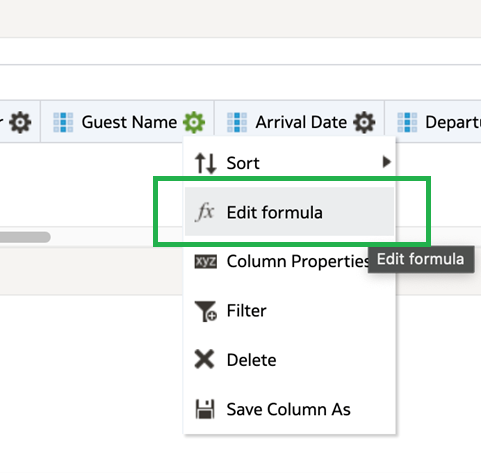
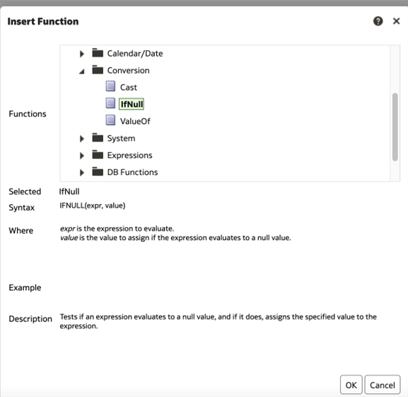
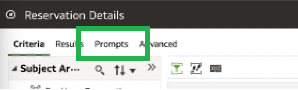
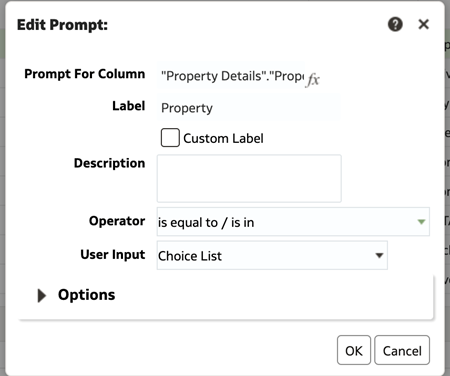
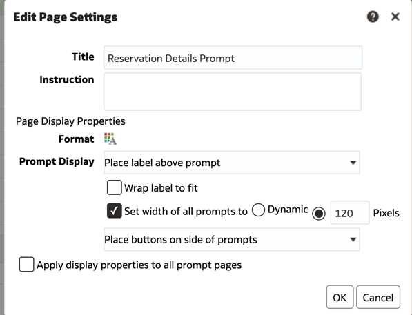
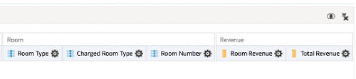

# Creating Analysis Report from Subject Area 

Getting started with Oracle Hospitality Reporting and Analytics

1. [Accessing the Reporting Application](#1-accessing-the-reporting-application)
2. [Accessing Analysis](#2-accessing-analysis)
3. [Adding Columns and measures to an analysis](#3-adding-columns-and-measures-to-an-analysis)
4. [Editing Column Formulas](#4-editing-column-formulas)
5. [Adding Filters to an analysis](#5-adding-filters-to-an-analysis)
6. [Adding Prompts to an Analysis](#6-adding-prompts-to-an-analysis)
7. [Setting the View Order](#7-setting-the-view-order)
8. [Saving the Analysis](#8-saving-the-analysis)

## 1. Accessing the Reporting Application

1. Access the R&A Portal application from your instance or the provided instance.
2. b.	From the Portal home page, select on the Reports and Dashboards Tile, alternatively from the drop down menu you can select Reports and Dashboards.


## 2. Accessing Analysis

1.	From the Reporting application, on the left hand Create menu, select analysis, or select create on the right hand menu, and choose analysis.


2.	Choose the Bookings – Reservation subject area


## 3. Adding Columns and measures to an analysis

1.	From the subject area, select the below fields and add then to the Selected Columns section of the criteria page, by double selecting the attribute, or dragging and dropping the attribute into the selected columns section


List of fields:

| Fields for Analysis Report |
| ---------------------------------- |
| Property Details - Property |
| Property Details – Property Name |
| Reservation Overview – Details – Confirmation Number |
| Reservation Overview – Details – Individual Last Name |
| Reservation Overview – Details – Arrival Date |
| Reservation Overview – Details – Departure Date |
| Reservation Overview – Details – Number of Nights |
| Reservation Overview – Details – Reservation Status |
| Reservation Overview – Details – Company Name |
| Reservation Overview – Stay Details – Block Code |
| Reservation Overview – Stay Details – Block Name |
| Reservation Overview – Stay Details – Adults |
| Reservation Overview – Stay Details – Children |
| Rate – Rates – Rate Code |
| Rate – Rates – Effective Rate Amount |
| Rate – Packages – Package Code |
| Rate – Marketing – Market Code |
| Rate – Marketing – Source Code |
| Rate – Marketing – Origin Code |
| Room – Room Type |
| Room – Charged Room Type |
| Room – Room Number |
| Revenue - Room Revenue |
| Revenue – Total Room Revenue |

## 4. Editing Column Formulas

1. To access column formulas, select on the gear icon within an added column, and choose Edit Column Formula



2. Using Concatenation Function

* Select the gear icon on the Individual Last Name attribute, and choose Edit Formula
* In the column formula, after the attribute, add 2 pipes || followed by a single quote comma space and another single quote 
* From the Reservations Overview – Details folder, add the Individual First Name attribute to the formula.  
* Check the Custom Headings attribute and change the column heading to Guest Name.  This is important or the column name will show as the formula 
* Column formula should look like below:

```"Details"."Individual Last Name"||', '||"Details"."Individual First Name"```


3.	Using If Null functions

*	Select the gear icon on the Company Name attribute, and choose edit formula
*	With the "Details"."Company Name" attribute highlighted, select the function button f(…) and in the conversion folder, choose IfNull and then OK



* In the formula, IFNULL("Details"."Company Name", value) highlight value, and add the Reservations Overview – Details – Travel Agent Name attribute.  

```IFNULL("Details"."Company Name", "Details"."Travel Agent Name")```

* Repeating 2 steps above, but highlighting "Details"."Travel Agent Name", add another IfNull function
* Selecting the Value field again, replace with Reservations Overview – Details – Source Name attribute.  
* Select the custom headings option and change the column heading to Company/TA/Source and select OK
* New formula should look like the below:

```IFNULL("Details"."Company Name", IFNULL("Details"."Travel Agent Name", "Details"."Source Name"))```

4.	Using the List Aggregate Function to combine multiple values in a single row

* Select the gear icon on the Package Code attribute, and choose edit formula
* In the Column formula section, add the following text around the "Packages"."Package Code" attribute LISTAGG( )
* Select the custom headings option and change the column heading to Package Code and select OK
* New Formula should look like the below: 

```LISTAGG("Packages"."Package Code")```

5.	Using the Case(IF) function

* Select the gear icon on the Room Revenue attribute, and choose edit formula
* Highlight the "Revenue"."Room Revenue" attribute in the column formula and select the Function button f(…) 
* Under the expressions folder, select the Case (if) function and select OK
* Replace the request_condition1 with the Reservations Overview – Details – Reservation Status attribute, and add = ‘CHECKED OUT’ in front of THEN as seen below

```CASE WHEN "Details"."Reservation Status"  = 'CHECKED OUT' THEN```

* After the ELSE statement, replace the expr2 with the Revenue – Projected Room Revenue attribute as seen below: 

```ELSE  "Revenue"."Projected Room Revenue"  END```

* Select on Custom Heading and change column heading to Room Revenue and Select OK
* New Formula should look like the below: 

```CASE WHEN "Details"."Reservation Status" = 'CHECKED OUT' THEN "Revenue"."Room Revenue" ELSE  "Revenue"."Projected Room Revenue"  END```

6.	Repeat Steps 5 using Case (If) function, and follow same steps on the Total Revenue attribute, using the Projected Total Revenue field.
* Column formula should look like the below

```CASE WHEN "Details"."Reservation Status" = 'CHECKED OUT' THEN "Revenue"."Total Revenue" ELSE "Revenue"."Projected Total Revenue"  END```

## 5. Adding Filters to an Analysis

1. Select the gear icon on the property attribute, and choose Filter


2. In the operator section, choose the dropdown and select is Prompted


3. Repeat the same steps, for the following attributes to add filters

* Reservation Overview – Details – Arrival Date
* Room – Room Type
* Reservation Overview – Details – Reservation Status

4. In the filters section, select the filter icon, and choose more columns

5. Choose the Reservation Overview – Daily Details – Stay Date attribute, and add a is prompted filter

      

6. Follow the same step and add a prompted filter for the below attributes

* Rooms – Room Class
* Reservations Overview – Details – Company Name
* Reservations Overview – Details – Travel Agent Name
* Reservations Overview – Details – Source Name

## 6. Adding Prompts to an Analysis

1. Select the Prompts Tab



2. Select the + icon and choose column prompt, and select Property



3. Choose the options drop down, and add the Include “All Column Values” choice in list, and Require User Input and select OK


4.	Add Prompts for the following attributes, by either selecting the column name from the list, or choosing the more columns and adding it from the subject area directly. Each column will also have the operator value, user input and option values listed:

||||
| ---------------------------------- | ---------------------------------- | ---------------------------------- |
| Attribute name | Operator Value | User Input |
| Arrival Date | Between | Calendar |
| Stay Date | Between | Calendar |
| Reservation Status | Is equal to/ is in | Choice list |
| Room Class | Is equal to/ is in | Choice list |
| Room Type | Is equal to/ is in | Choice list |
| Package Code | Is equal to/ is in | Choice list |
| Block Code | Is equal to/ is in | Choice list |
| Travel Agent Name | Is equal to/ is in | Choice list |
| Company Name | Is equal to/ is in | Choice list |
| Source Name | Is equal to/ is in | Choice list |

5. Select the Pencil Icon in the display section, next to Page 1


6. Update the title to Reservation Details Prompt, change the Prompt Display to “place Label Above Prompt” and change the buttons option to “Place buttons on side of prompt”  Select OK



7. In the Prompt Label section, select New Row next to the below Prompts

* Arrival Date, Reservation Status, Room Class, Block Code, and Travel Agent Name


## 7. Setting the View Order

1. In the criteria section re-arrange the columns so that they are in the order in the screenshots below.  You can do this by dragging and dropping the columns where they need to be.




## 8. Saving the Analysis

1. Select the Save as icon

2. Save the analysis into the below directory as Reservation Details

||
|-------------|
| Shared Folder/{OrgCode}/Bootcamp/YOURNAME |
