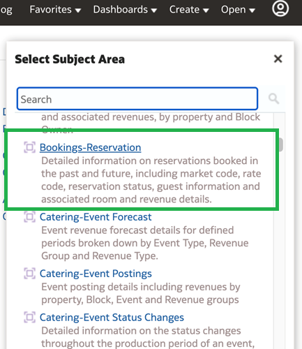
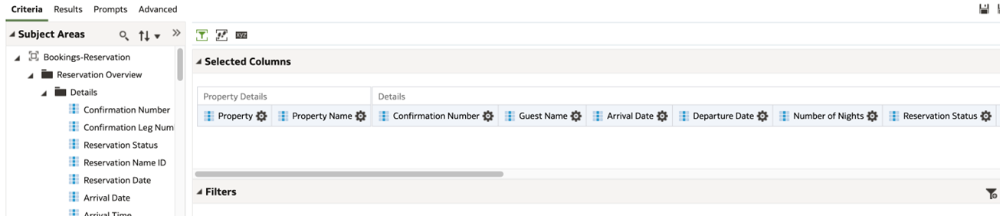
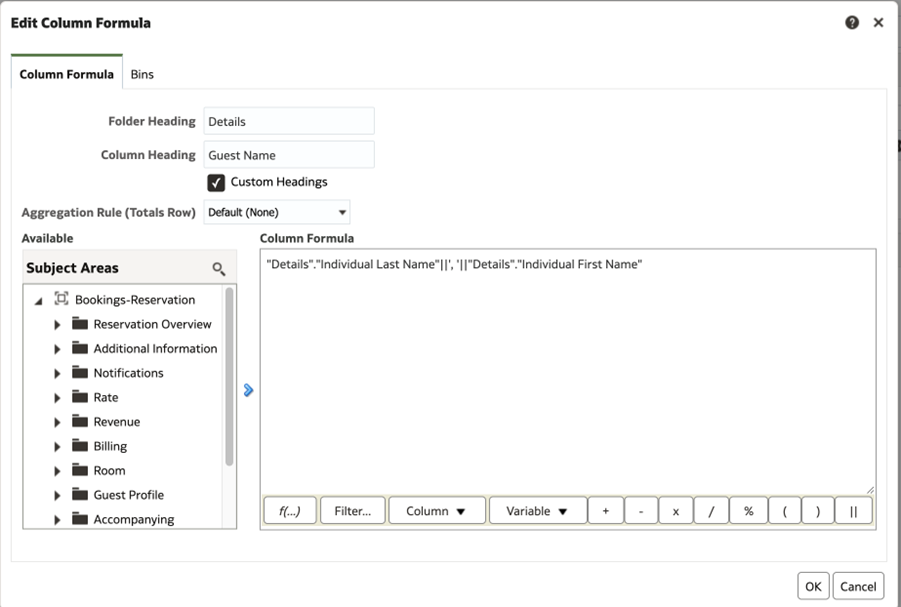
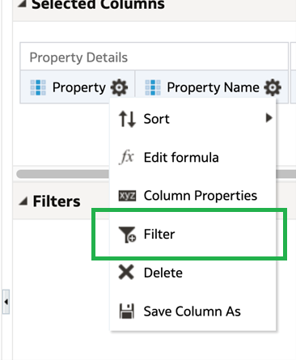
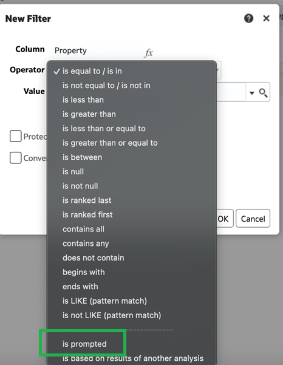
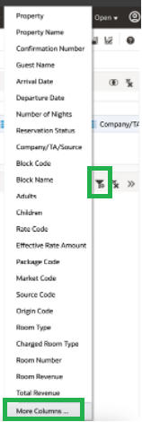
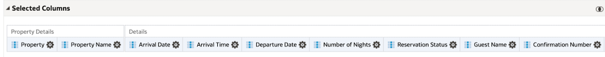

# Creating Arrivals Details Analysis

Getting started with Oracle Hospitality Reporting and Analytics

1. [Accessing the Reporting Application](#1-accessing-the-reporting-application)
2. [Accessing Analysis](#2-accessing-analysis)
3. [Adding Columns and measures to an analysis](#3-adding-columns-and-measures-to-an-analysis)
4. [Editing Column Formulas](#4-editing-column-formulas)
5. [Adding Filters to an analysis](#5-adding-filters-to-an-analysis)
6. [Adding Prompts to an Analysis](#6-adding-prompts-to-an-analysis)
7. [Setting the View Order](#7-setting-the-view-order)
8. [Saving the Analysis](#8-saving-the-analysis)

## 1. Accessing the Reporting Application

1. Access the R&A Portal application from your instance or the provided instance.
2. b.	From the Portal home page, select on the Reports and Dashboards Tile, alternatively from the drop down menu you can select Reports and Dashboards.


## 2. Accessing Analysis

1.	From the Reporting application, on the left hand Create menu, select analysis, or select create on the right hand menu, and choose analysis.


2.	Choose the Bookings – Reservation subject area



## 3. Adding Columns and measures to an analysis

1.	From the subject area, select the below fields and add then to the Selected Columns section of the criteria page, by double selecting the attribute, or dragging and dropping the attribute into the selected columns section



List of fields:

| Fields for Analysis Report |
| ---------------------------------- |
| Property Details - Property |
| Property Details – Property Name |
| Reservation Overview – Details – Arrival Date |
| Reservation Overview – Details – Departure Date |
| Reservation Overview – Details – Number of Nights |
| Reservation Overview – Details – Reservation Status |
| Reservation Overview – Details – Individual Last Name |
| Reservation Overview – Details – Confirmation Number |
| Reservation Overview – Details – External Reference |
| Reservation Overview – Stay Details – Block Code |
| Reservation Overview – Stay Details – Block Name |
| Reservation Overview – Stay Details – Guest Type |
| Reservation Overview – Stay Details – Purpose of Stay |
| Reservation Overview – Stay Details – Adults |
| Reservation Overview – Stay Details – Children |
| Reservation Overview – Stay Details – Children Ages |
| Reservation Overview – Stay Details – Total Cost of Stay |
| Guest Profile – Profiles Individuals – Additional Details – VIP Code |
| Reservation Overview – Reservation Preferences - Preference |
| Rate – Rates – Rate Code |
| Rate – Rates – Effective Rate Amount |
| Rate – Packages – Package Code |
| Rate – Marketing – Market Code |
| Rate – Marketing – Source Code |
| Rate – Marketing – Origin Code |
| Rate – Item Inventory – Item Code |
| Rate – Item Inventory – Quantity |
| Rate – Item Inventory – Start Date |
| Rate – Item Inventory – End Date |
| Room – Room Class |
| Room – Room Type |
| Room – Room Number |
| Guest Profile – Profiles Individuals – Guest Details – Email |
| Guest Profile – Profiles Individuals – Membership – Membership Type |
| Guest Profile – Profiles Individuals – Membership – Membership Level |
| Accompanying – Guest Details – Last Name |
| Notifications – Reservation Notes – Comment |
| Additional Information – Shares – Shared Confirmation No. |
| Additional Information – Shares – Shared Guest Name |


## 4. Editing Column Formulas

1. To access column formulas, select on the gear icon within an added column, and choose Edit Column Formula


2. Using Concatenation Function

* Select the gear icon on the Individual Last Name attribute, and choose Edit Formula
* In the column formula, after the attribute, add 2 pipes || followed by a single quote comma space and another single quote 
* From the Reservations Overview – Details folder, add the Individual First Name attribute to the formula.  
* Check the Custom Headings attribute and change the column heading to Guest Name.  This is important or the column name will show as the formula 
* Column formula should look like below:

```"Details"."Individual Last Name"||', '||"Details"."Individual First Name"```



3.	Using the List Aggregate Function to combine multiple values in a single row

* Select the gear icon on the Package Code attribute, and choose edit formula
* In the Column formula section, add the following text around the "Packages"."Package Code" attribute LISTAGG( )
* Select the custom headings option and change the column heading to Package Code and select OK
* New Formula should look like the below: 

```LISTAGG("Packages"."Package Code")```

4. Repeat Steps 3, for Reservation Overview – Reservation Preferences – Preference

* New Formula should like the below

```LISTAGG("Reservation Preferences"."Preference")```

5.	Using the Case(IF) function

* Select the gear icon on the Notifications – Reservation Notes – Comment attribute, and choose edit formula
* Highlight the "Reservation Notes"."Comment" attribute in the column formula and select the Function button f(…) 
* Under the expressions folder, select the Case (if) function and select OK
* Replace the request_condition1 with the Notifications – Reservation Notes – Notification Area attribute, and add IN (‘CHECK IN’,’RESERVATION’) in front of THEN as seen below

```CASE WHEN "Reservation Notes"."Notification Area" in ('CHECK IN','RESERVATION') THEN```

* After THEN, add LISTAGG( ) around "Reservation Notes"."Comment" as seen below: 

```THEN LISTAGG("Reservation Notes"."Comment") ELSE```

* After the ELSE statement, replace the expr2 with the NULL as seen below

```ELSE NULL END```

* Select on Custom Heading and change column heading to Comments and Select OK
* New Formula should look like the below: 

```CASE WHEN "Reservation Notes"."Notification Area" in ('CHECK IN','RESERVATION') THEN LISTAGG("Reservation Notes"."Comment") ELSE NULL```


## 5. Adding Filters to an Analysis

1. Select the gear icon on the property attribute, and choose Filter



2. In the operator section, choose the dropdown and select is Prompted



3. Repeat the same steps, for the following attributes to add filters

* Reservation Overview – Details – Arrival Date
* Reservation Overview – Stay Details – Block Code
* Reservation Overview – Stay Details – Block Name
* Guest Profile – Profiles Individuals – Additional Details – VIP Code
* Rate – Rates – Rate Code
* Room – Room Class
* Room – Room Type
* Rate – Marketing – Market Code
* Rate – Marketing – Source Code
* Rate – Marketing – Origin Code
* Guest Profile – Profiles Individuals – Membership – Membership Type
* Guest Profile – Profiles Individuals – Membership – Membership Level

4. In the filters section, select the filter icon, and choose more columns

5. Choose the Reservation Overview – Daily Details – Stay Date attribute, and add a is prompted filter

      

6. Select the gear icon on the Reservation Status Attribute, and choose Filter

7. Leave operator as is equal to/ is in

8. In the Value dropdown, select RESERVED. Use the drop down instead of typing, as if value doesn’t match exactly, the filter will not work


## 6. Adding Prompts to an Analysis

1. Select the Prompts Tab


2. Select the + icon and choose column prompt, and select Property


3. Choose the options drop down, and add the Include “All Column Values” choice in list, and Require User Input and select OK


4.	Add Prompts for the following attributes, by either selecting the column name from the list, or choosing the more columns and adding it from the subject area directly. Each column will also have the operator value, user input and option values listed:

||||||
| ---------------------------------- | ---------------------------------- | ---------------------------------- | ---------------------------------- | ---------------------------------- |
| Attribute name | Operator Value | User Input | Option Value | Default Selection |
| Arrival Date | Between | Calendar | | |
| Stay Date | Between | Calendar | | |
| Reservation Status | Is equal to/ is in | Choice list | | Specific Values RESERVED |
| Block Code | Is equal to/ is in | Choice list | | |
| Block Name | Is equal to/ is in | Choice list | | |
| VIP Code | Is equal to/ is in | Choice list | | |
| Market Code | Is equal to/ is in | Choice list | | |
| Source Code | Is equal to/ is in | Choice list | | |
| Room Class | Is equal to/ is in | Choice list | | |
| Room Type | Is equal to/ is in | Choice list | | |
| Membership Type | Is equal to/ is in | Choice list | | |
| Membership Level | Is equal to/ is in | Choice list | | |

5. Select the Pencil Icon in the display section, next to Page 1


6. Update the title to Arrivals Detailed, change the Prompt Display to “place Label Above Prompt” and change the buttons option to “Place buttons on side of prompt”  Select OK


7. In the Prompt Label section, select New Row next to the below Prompts

* Arrival Date, Reservation Status, Block Code, VIP Code, Rate Code, Room Class and Membership Type


## 7. Setting the View Order

1. In the criteria section re-arrange the columns so that they are in the order in the screenshots below.  You can do this by dragging and dropping the columns where they need to be.




## 8. Saving the Analysis

1. Select the Save as icon

2. Save the analysis into the below directory as Reservation Details

||
|---------|
| Shared Folder/{OrgCode}/Bootcamp/YOURNAME |
