# Scheduling and Bursting Reports

Getting started with Oracle Hospitality Reporting and Analytics

1. [Accessing the Reporting Application](#1-accessing-the-reporting-application) 
2. [Scheduling an Analysis Report](#2-scheduling-an-analysis-report)
3. [Job Scheduler and Bursting BI Publisher Reports](#3-job-scheduler-and-bursting-bi-publisher-reports)

## 1. Accessing the Reporting Application

1. Access the R&A Portal application from your instance or the provided instance.
2. b.	From the Portal home page, select on the Reports and Dashboards Tile, alternatively from the drop down menu you can select Reports and Dashboards.


## 2. Scheduling an Analysis Report

1. Scheduling an analysis report for delivery can be achieved by utilizing the Agents functionality in R&A.  There are multiple ways to schedule an agent.  In this first activity, we will deliver an Analysis with a condition to your users email address

2.	Access the Catalog by choosing the catalog menu from the top left corner of the OAS banner

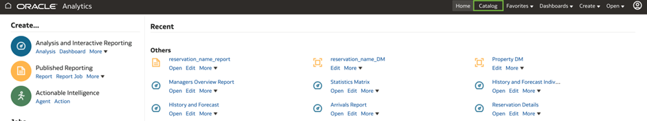

3.	Access the Shared Folders/ Htl Templates directory


4.	Select the Managers Overview Report, and select the More dropdown menu

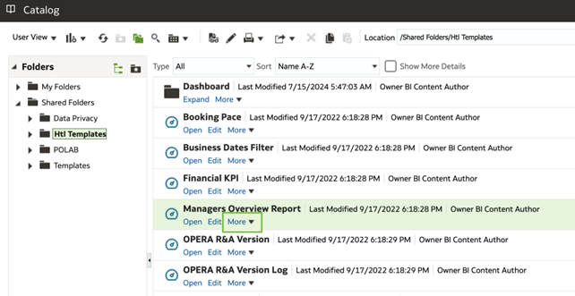

5.	Select the Schedule option from the dropdown menu


6.	On the General Tab, leave the Priority as Normal and set the Run As option to Recipient

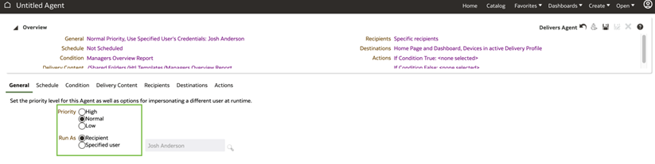

7.	Move to the Schedule Tab and make below updates to the scheduler
* Frequency = Once
* Start = todays date, and 15 minutes from current time making sure the time zone is set correctly

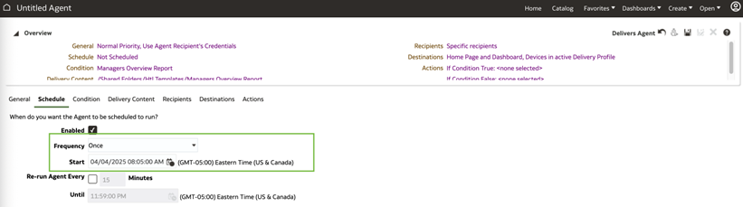

8.	Move to the condition tab. Here we are just reviewing the information on the screen to ensure there is a condition, and we will test the condition to see if it is true, by selecting the Test option next to the condition

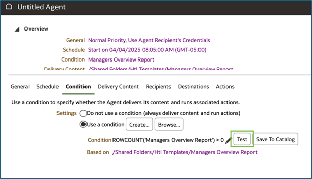

* The condition will either come back as True or False


9.	Move to the Delivery Content Tab.  When scheduling from an existing Analysis, the content will automatically be selected

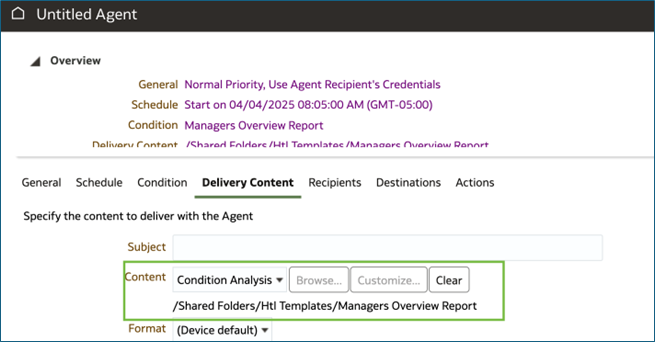

* Fill in the Subject with the title of the e-mail you want

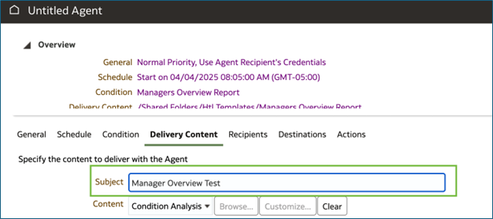

* Select the format dropdown menu, and choose PDF as the file format


* When changing the format, the Delivery option will automatically change to Deliver as attachment.  Add a text to the Attachment note, which will be in the body of the email


* Select the If Condition is False check box and add a note to deliver if the condition returns False


* Move to the recipients Tab to verify that your User is shown in the recipients box and other options match the screenshot


* Move to the Destinations Tab, and validate that Home Page and Dashboard as well as Devices active Delivery Profile are selected


* Select the Save (disk) icon from the top left menu

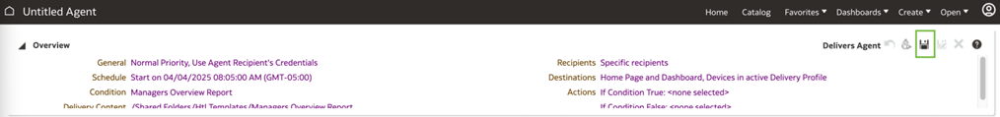

* Select Shared folder, and using the add Folder icon, create a folder call Agents

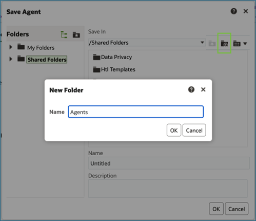

* Name the Agent, Manager Overview Agent and select OK


* After the agent is saved, you should see the robot icon is not greyed out, meaning that it is active. The Agent should deliver based on the scheduled time setup


## 3. Job Scheduler and Bursting BI Publisher Reports

1.	Scheduling a BI Publisher report for delivery can be achieved by utilizing the Job Scheduler functionality in R&A. There are multiple ways to schedule these jobs. In this first activity, we will deliver a BI Publisher report with bursting to your email address.

2.	Access the Catalog by choosing the catalog menu from the top left corner of the OAS banner


 
3.	Access the Shared Folders/ {Org Code}/Bootcamp/{YOUR NAME} directory

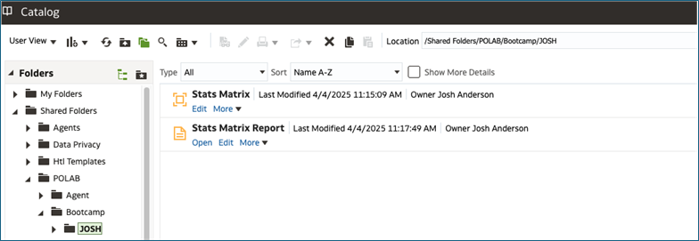

4.	Edit the Data Model by selecting the Edit Option on the Stats Matrix data model created in the Convert analysis to BI Publisher report Lab

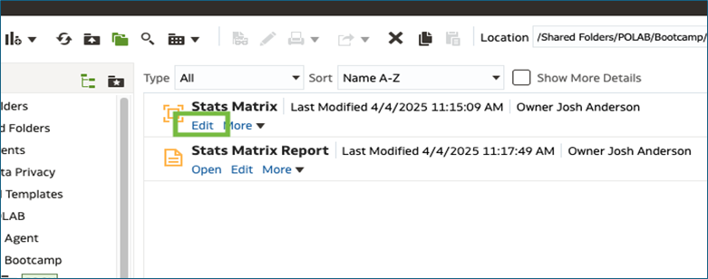
  
5.	Select on the Bursting option and select the + icon to add a new bursting query


 
6.	Rename the bursting  from Bursting 1 to EMAIL
 
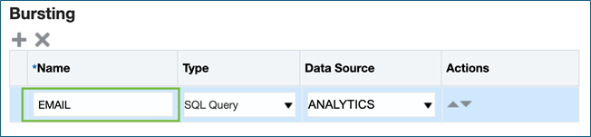

7.	In the bottom section of the bursting query, change the Split By and Deliver By values to be /DATA_DS/G_1/PROPERTY using the dropdown menu

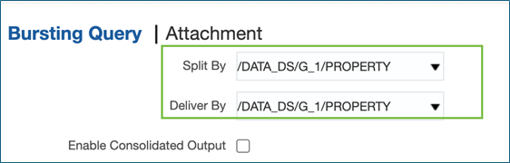
 
8.	Copy the below SQL query into the SQL Query window.  In the next step we will update the parameters to match what is required. 

```
select DISTINCT
RESORT KEY,
'TEMPLATE_NAME' TEMPLATE,
'RTF' TEMPLATE_FORMAT,
'en-US' LOCALE,
'PDF' OUTPUT_FORMAT,
'Email' DEL_CHANNEL, -- Can be any of the output type part of the Template
'File_name_formula - '||Resort||'_'||to_Char(Sysdate-1,'YYYYMMDD') OUTPUT_NAME,
'xxx.xxx@xxx.com' PARAMETER1, -- TO ADDRESS
'yyy.yyy@yyy.com' PARAMETER2, -- CC ADDRESS
'noreply_cds_gbu-analytics@gbua.ocs.oraclecloud.com' PARAMETER3, -- FROM ADDRESS
'EMAIL_SUBJECT' PARAMETER4,
'EMAIL_BODY' PARAMETER5,
'true' PARAMETER6
from RESORT
```

9.	Update the following rows in the query to correct the parameters to meet your specific job

* TEMPLATE – The report name that will be used for bursting. The report name can be retrieved from the Properties menu of the report.
* OUTPUT_FORMAT – The output format of the delivered report such as PDF.
* Replace with: 'Statistics_Matrix_'||RESORT||'.pdf'
* TO ADDRESS – The Email address/es to which the report will be sent. To enter multiple email addresses, use the following format: ‘xxx@xxxx.com,yyy@yyyy.com’
* PARAMETER 4 – Indicates the subject line of the email.
* PARAMETER 5 – Indicates the email body.
* Replace with: 'Attached is the output for '||RESORT ||'.pdf' 
 
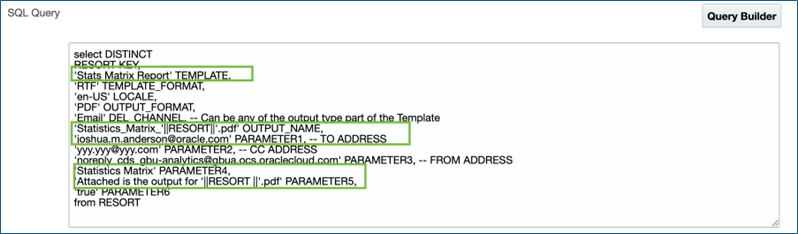

10. Save the data model by selecting on the DISK icon

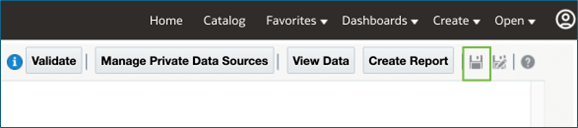

11. Select the Catalog option in the top right corner.  You should be brought directly into the latest catalog location, but if not navigate back to Shared Folders/ {Org Code}/Bootcamp/{YOUR NAME} directory
 
 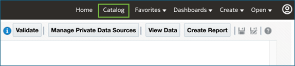

12. Edit the Stats Matrix Report file
 
 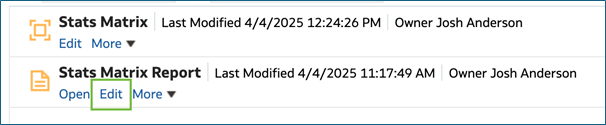

13. Select the Properties option in the top right corner

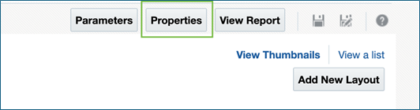

14. Check the Enable Bursting option, and ensure the Email option is selected in the drop down.  Then select OK

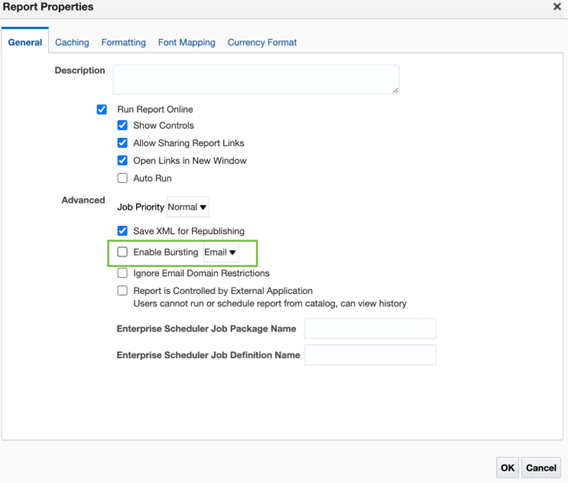
 
15. Select the disk Icon to save the report
 
 

16. Select the Catalog option in the top right corner.  You should be brought directly into the latest catalog location, but if not navigate back to Shared Folders/ {Org Code}/Bootcamp/{YOUR NAME} directory
 


17. Select the more options dropdown on the Stats Matrix Report and select Schedule

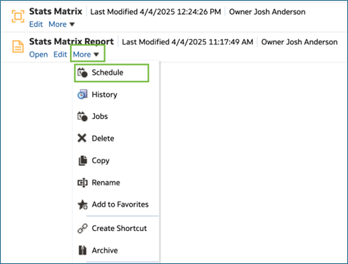

18. On the General tab, you can select a resort or leave it as all


 
19. Move to the output tab, and ensure that Use Bursting Definition to Determine Output & Delivery Destination, Make Output Public and Save Data for Republishing are all checked


 
20. Move to the Schedule Tab, and validate that Frequency = Once, and Run Now is selected

 

21. Select the Submit option in the top right corner, to send the Report.  

  

22. Name the report job Stats Matrix Test and select OK.  You will get a notification that the report job was submitted successfully
 

