# Working with Data Visualisation

Getting started with Oracle Hospitality Reporting and Analytics

1. [Accessing Data Visualiser](#1-accessing-data-visualiser)
2. [Creating a Data Visualiser Project](#2-creating-a-data-visualiser-project)
3. [Creating a second Canvas](#3-creating-a-second-canvas)
4. [Creating a map view with data visualiser](#4-creating-a-map-view-with-data-visualiser)
5. [Saving the Data Visualiser Project](#5-saving-the-data-visualiser-project)

## 1. Accessing Data Visualiser

1. Access the R&A Portal application from your instance or the provided instance.
2. b.	From the Portal home page, select on the Data Visualiser Tile, alternatively from the drop down menu you can select Data Visualiser.

## 2. Creating a Data Visualiser Project

1. After accessing Data Visualiser, select on Create in the top right corner

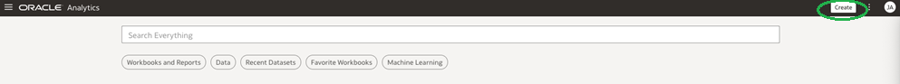

2. Select Workbook from the menu produced

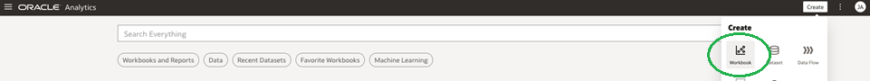

3. Select on subject areas, and choose Statistics – Reservation Daily and add to workbook

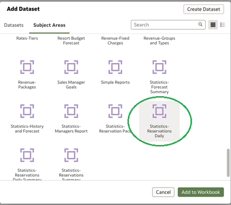

4. Select the following fields and add them to the table layout on the visualization as shown. The default visualization should be a table, but if needed you can select the drop down to choose it.

* Marketing - County Code 
* Marketing - Guest Details - Country 
* Room Details - Room Nights
* Guest Details - Stay Adults
* Guest Details - Stay Children
* Revenue Details - Room Revenue
* Revenue Details - Total Revenue

5. Add a filter for Year, by selecting Dates – Business Date Calendar – Year, right click on the field, and Create Filter

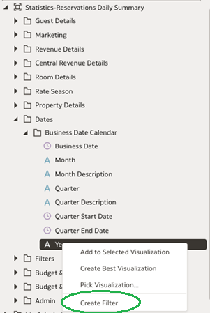

6. Select the year in the list and add to the selections column

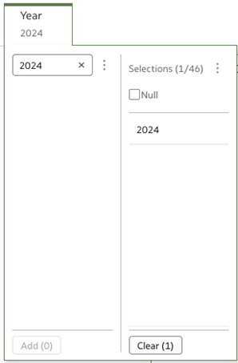

## 3. Creating a Second Canvas

1. Select the + icon next to the canvas 1 at the bottom of the workbook

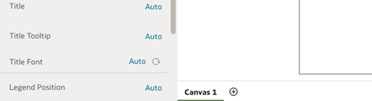

## 4. Creating a map view with data Visualiser

1. Select the field, Marketing - County Code ,  and add to the presentation canvas

2. Under auto visualisation drop down, change view to map

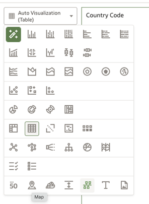

3. Add Room Details - Room Nights to the color layer

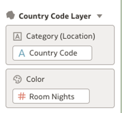

4. Add Revenue Details - Total Revenue to the Size Layer

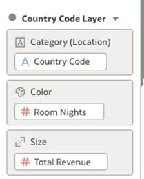

5. To change the color of the assignments, select the drop down arrow under the color layer, and select Manage Assignments

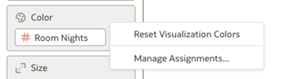

6. Choose the color you would like to display, and select done

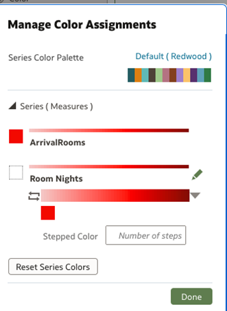

## 5. Saving the Data Visualiser Project

1. Select the dropdown arrow, next to the Disk Icon in the top right corner and choose Save As

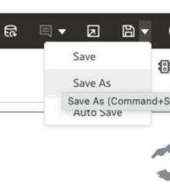

2. Choose the Shared Folders/”Org Code”/Bootcamp/”YOUR NAME” directory and save the file as Room Nights and Revenue Map

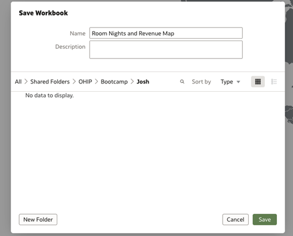
